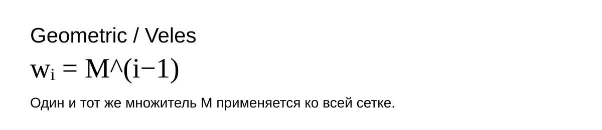
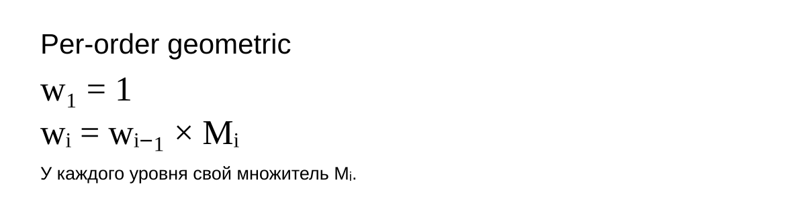

# Мартингейл и распределение объёма по Grid Orders

**Статус: CONFIRMED CORE FORMULAS + OPTIONAL SIZING MODES**

Эта страница описывает только **распределение капитала / номинала / объёма между ордерами сетки**.

Она не определяет расстояние между ценовыми уровнями. Геометрия Grid и sizing — два независимых слоя:

```text
Grid Geometry → где стоят ордера по цене
Grid Sizing   → сколько капитала / номинала / qty получает каждый ордер
```

Для Generated Grid цена уровней может рассчитываться отдельной функцией распределения, например через коэффициент `K`. Martingale не должен менять цены уровней сам по себе.

---

## 1. Главное различие: Geometric / Veles и Per-order geometric

Оба режима являются **геометрическим ростом веса**, но управляются по-разному.

### Geometric / Veles — один коэффициент на всю сетку

Трейдер задаёт один Martingale для всей стороны Grid.

Если `M = 1.20`, каждый следующий уровень получает вес на 20% больше предыдущего:

```text
w1 = 1
w2 = 1 × 1.20 = 1.20
w3 = 1.20 × 1.20 = 1.44
w4 = 1.44 × 1.20 = 1.728
w5 = 1.728 × 1.20 = 2.0736
```

Общая формула:

```text
w_i = M^(i-1)
```



Если Martingale задаётся процентом `m`, то:

```text
M = 1 + m
```

Например:

```text
Martingale = 20%
M = 1.20
```

**Смысл:** форма роста заранее одинакова для всей сетки. Изменение одного global `M` перестраивает веса всех уровней.

---

### Per-order geometric — свой коэффициент для каждого перехода

У каждого уровня, начиная со второго, есть собственный `M_i`.

```text
w1 = 1
w_i = w_(i-1) × M_i
```



Пример:

```text
M2 = 1.20
M3 = 1.50
M4 = 1.10
M5 = 1.30

w1 = 1
w2 = 1 × 1.20       = 1.20
w3 = 1.20 × 1.50    = 1.80
w4 = 1.80 × 1.10    = 1.98
w5 = 1.98 × 1.30    = 2.574
```

Эквивалентная формула:

```text
w_i = Π(M_j), j = 2..i
```

**Смысл:** трейдер управляет ростом каждого отдельного участка сетки. Один уровень можно увеличить умеренно, следующий агрессивнее, затем снова снизить темп роста.

---

## 2. Чем эти модели отличаются на практике

| Свойство | Geometric / Veles | Per-order geometric |
| --- | --- | --- |
| Параметров | один `M` на всю сетку | отдельный `M_i` для каждого перехода |
| Рост | одинаковый процент на каждом шаге | процент может отличаться на каждом шаге |
| Формула | `w_i = M^(i-1)` | `w_i = w_(i-1) × M_i` |
| Контроль | простой | более гибкий |
| Изменение параметра | меняет всю кривую весов | меняет текущий и все последующие cumulative weights при полном пересчёте |
| Primary Manual Grid | optional | **CONFIRMED primary sizing model** |
| Generated Grid | **CONFIRMED legacy/optional model** | может использоваться отдельно |

Важно: **Geometric / Veles является частным случаем Per-order geometric**.

Если:

```text
M2 = M3 = M4 = ... = M
```

то:

```text
w_i = M^(i-1)
```

То есть в backend не нужны два принципиально разных движка. Можно использовать единый cumulative weight engine, а global Martingale просто подставляет одинаковый `M_i` для всех уровней.

---

## 3. Martingale применяется к капиталу / номиналу, а не напрямую к coin qty

Это принципиально важно.

Правильная последовательность:

```text
Side Budget
↓
Weights
↓
Normalized weights
↓
Margin allocation per order
↓
Position notional per order
↓
Coin qty = notional / Entry Price
↓
Bybit normalization and validation
```

Нельзя считать canonical Martingale так:

```text
qty_next = qty_previous × M
```

потому что цена каждого уровня отличается.

Одинаковый рост номинала при разных Entry Price создаёт разные отношения количества монет.

Для Long при снижении Entry Price количество монет обычно растёт быстрее, чем сам номинал. Для Short при росте Entry Price coin qty может расти медленнее или даже уменьшаться при небольшом Martingale.

Именно эту семантику отдельно указывает Veles: Martingale применяется к **номинальной стоимости ордера**, а не к количеству монет.

Источник Veles:
- [RU — Что такое усреднение, Мартингейл и логарифм](https://help.veles.finance/ru/getting-started/strategies/dca/)
- [EN — What Are Averaging, Martingale, and Logarithmic Distribution](https://help.veles.finance/en/getting-started/strategies/dca/)
- [Veles Trading Mode — Simple / Own / Signal](https://help.veles.finance/en/platform/settings/trading-mode/)

---

## 4. Универсальная формула распределения бюджета

После получения необработанных весов:

```text
w1, w2, ... wn
```

считается их сумма:

```text
W = Σw_i
```

Доля каждого ордера:

```text
allocation_i = w_i / W
```

Для доступного future margin budget `B`:

```text
margin_i = B × allocation_i
```

При leverage `L`:

```text
notional_i = margin_i × L
```

Количество монеты:

```text
raw_qty_i = notional_i / entry_price_i
```

После этого:

```text
qty_i = ROUND_DOWN_TO_QTY_STEP(raw_qty_i)
```

и выполняется обязательная проверка Bybit instrument limits.

---

## 5. Пример Global Martingale 20%

Пусть:

```text
Future Side Margin Budget B = 1,000 USDT
Leverage L = 5x
Orders N = 5
Martingale = 20%
M = 1.20
```

Веса:

```text
#1 = 1.0000
#2 = 1.2000
#3 = 1.4400
#4 = 1.7280
#5 = 2.0736

Σw = 7.4416
```

Нормализованные доли:

| Order | Weight | Share | Margin from 1,000 | Notional at 5x |
| ---: | ---: | ---: | ---: | ---: |
| #1 | 1.0000 | 13.44% | ~134.38 | ~671.9 |
| #2 | 1.2000 | 16.13% | ~161.25 | ~806.2 |
| #3 | 1.4400 | 19.35% | ~193.50 | ~967.5 |
| #4 | 1.7280 | 23.22% | ~232.20 | ~1,161.0 |
| #5 | 2.0736 | 27.86% | ~278.67 | ~1,393.4 |

После этого coin qty каждого уровня зависит от его собственной Entry Price.

Например, если Entry Price #5 = `200 USDT`:

```text
raw_qty_5 = 1393.4 / 200 ≈ 6.967
```

Затем qty приводится к Bybit `qtyStep` и проверяется по `minOrderQty` и `minNotionalValue`.

---

## 6. Как Martingale считает Veles

Veles описывает Martingale так:

```text
New Order Face Value = Previous Order Face Value × (1 + Martingale %)
```

То есть при `20%` номинал каждого следующего order примерно в `1.20` раза больше предыдущего.

В официальном примере Veles для SOL/USDT используются уровни:

```text
Order #1: Price 202.91 → 13.5 SOL
Order #2: Price 192.76 → 17.1 SOL
Order #3: Price 182.61 → 21.6 SOL
Martingale = 20%
```

Проверим номиналы:

```text
#1: 202.91 × 13.5 ≈ 2,739.29 USDT
#2: 192.76 × 17.1 ≈ 3,296.20 USDT
#3: 182.61 × 21.6 ≈ 3,944.38 USDT
```

Отношения:

```text
3296.20 / 2739.29 ≈ 1.20
3944.38 / 3296.20 ≈ 1.20
```

То есть рост применяется именно к **face value / notional**, а qty получается уже из новой цены уровня.

По примеру Veles средняя цена позиции после исполнения этих трёх уровней снижается примерно до `191.18 USDT`.

Официальные источники:
- [Veles RU: Усреднение, Мартингейл и логарифм](https://help.veles.finance/ru/getting-started/strategies/dca/)
- [Veles EN: Averaging, Martingale and Logarithmic Distribution](https://help.veles.finance/en/getting-started/strategies/dca/)

---

## 7. Пример Per-order Martingale

Пусть:

```text
Future Side Margin Budget = 1,000 USDT
Leverage = 5x

M2 = 1.20
M3 = 1.50
M4 = 1.10
M5 = 1.30
```

Получаем:

```text
w1 = 1.000
w2 = 1.200
w3 = 1.800
w4 = 1.980
w5 = 2.574

Σw = 8.554
```

Доли:

| Order | M_i | Cumulative weight | Share | Margin |
| ---: | ---: | ---: | ---: | ---: |
| #1 | — | 1.000 | 11.69% | ~116.9 |
| #2 | 1.20 | 1.200 | 14.03% | ~140.3 |
| #3 | 1.50 | 1.800 | 21.04% | ~210.4 |
| #4 | 1.10 | 1.980 | 23.15% | ~231.5 |
| #5 | 1.30 | 2.574 | 30.09% | ~300.9 |

Это позволяет трейдеру, например:
- увеличить #3 сильнее;
- почти не увеличивать #4;
- снова повысить темп на #5.

В Global Martingale такой профиль невозможен без изменения всей кривой.

---

## 8. Другие поддерживаемые способы распределения

Платформу лучше строить вокруг общего интерфейса `Weight Generator`, а не отдельных несвязанных sizing engines.

### A. Equal / DCA

```text
w_i = 1
```

Пример:

```text
1 : 1 : 1 : 1 : 1
```

Все уровни получают одинаковую долю margin budget.

### B. Global Geometric / Veles

```text
w_i = M^(i-1)
```

Пример для `M=1.20`:

```text
1 : 1.2 : 1.44 : 1.728 : 2.0736
```

### C. Per-order Geometric

```text
w1 = 1
w_i = w_(i-1) × M_i
```

Основной подтверждённый режим Manual Grid.

### D. Arithmetic / Linear growth

```text
w_i = 1 + (i-1) × A
```

Например `A=0.25`:

```text
1 : 1.25 : 1.50 : 1.75 : 2.00
```

Рост мягче геометрического, потому что прибавляется фиксированная величина веса, а не процент от уже увеличенного веса.

**Статус: OPTIONAL, не является подтверждённой основной механикой стратегии.**

### E. Manual weights

Трейдер задаёт веса напрямую:

```text
1 : 1.3 : 2.0 : 3.5 : 5.0
```

После этого применяется тот же normalization pipeline.

**Статус: OPTIONAL / ADVANCED.**

### F. Reverse geometric

```text
0 < M < 1
```

Например `M=0.8`:

```text
1 : 0.8 : 0.64 : 0.512
```

Каждый следующий уровень получает меньшую долю капитала.

**Статус: OPTIONAL; не считать Martingale strategy проекта без отдельного подтверждения.**

---

## 9. Как это должно быть реализовано в платформе

Canonical backend pipeline:

```text
1. Determine eligible future orders.
2. Determine Future Side Margin Budget B.
3. Generate raw weights according to sizing mode.
4. Normalize weights across eligible orders.
5. Allocate margin_i.
6. Convert to notional_i using leverage.
7. Convert to raw_qty_i using each order Entry Price.
8. ROUND_DOWN according to current Bybit qtyStep.
9. Validate every order against Bybit instrument metadata.
10. Produce preview / RestructuringPlan.
```

Рекомендуемый enum:

```text
EQUAL
GLOBAL_GEOMETRIC
PER_ORDER_GEOMETRIC
MANUAL_WEIGHTS
ARITHMETIC        [optional]
REVERSE_GEOMETRIC [optional]
```

Global geometric можно технически реализовать через тот же per-order engine:

```text
for every i > 1:
    M_i = global_M
```

Это уменьшает количество разных calculation paths.

---

## 10. Связь с реструктуризацией

При изменении future budget, например после profitable TP/reinvestment, factual volume не меняется.

```text
Factual filled/open volume = immutable
Future pending volume      = recalculated
```

Пример:

```text
Old Future Budget = 1,000
New Future Budget = 1,150
```

При `RECALCULATE_GRID`:

```text
same configured weight model
→ normalize against 1,150
→ calculate new pending margin/notional/qty
```

То есть дополнительная маржа перераспределяется по всей eligible future grid согласно выбранным weights.

Точная логика, как новый капитал маршрутизируется между Long и Short, описана отдельно и пока остаётся исследовательским вопросом.

---

## 11. Bybit execution safety gate

После sizing весь план должен пройти техническую валидацию по актуальному instrument metadata Bybit:

```text
qty >= minOrderQty
qty aligned to qtyStep
notional >= minNotionalValue
price aligned to tickSize
```

Если хотя бы один обязательный order после расчёта не проходит биржевые ограничения:

```text
ENTIRE PLAN → BLOCKED / MANUAL_REVIEW
```

Нельзя автоматически:
- увеличить один order до минимума;
- взять недостающий капитал из Reserve;
- пропустить невалидный уровень и исполнить остальные;
- изменить Martingale без новой decision/revision.

---

## 12. Что подтверждено для проекта

**CONFIRMED:**
- Grid Geometry и Grid Sizing независимы;
- основной Manual Grid использует per-order Martingale;
- `w1 = 1`, `w_i = w_(i-1) × M_i`;
- global geometric остаётся валидной моделью optional Generated Grid;
- allocation выполняется через нормализацию весов на available future budget;
- factual filled volume не пересчитывается;
- Bybit limits являются hard execution guard.

**OPTIONAL / AVAILABLE MODEL:**
- Equal;
- Global Geometric / Veles;
- Manual weights;
- Arithmetic;
- Reverse geometric.

**OPEN:**
- какая sizing-модель будет default для разных типов Grid;
- допустимые UI ranges для `M_i`;
- должны ли `M_i < 1` разрешаться в primary Manual Grid;
- точная политика перераспределения reinvested capital между Long и Short;
- автоматические restructuring triggers.
